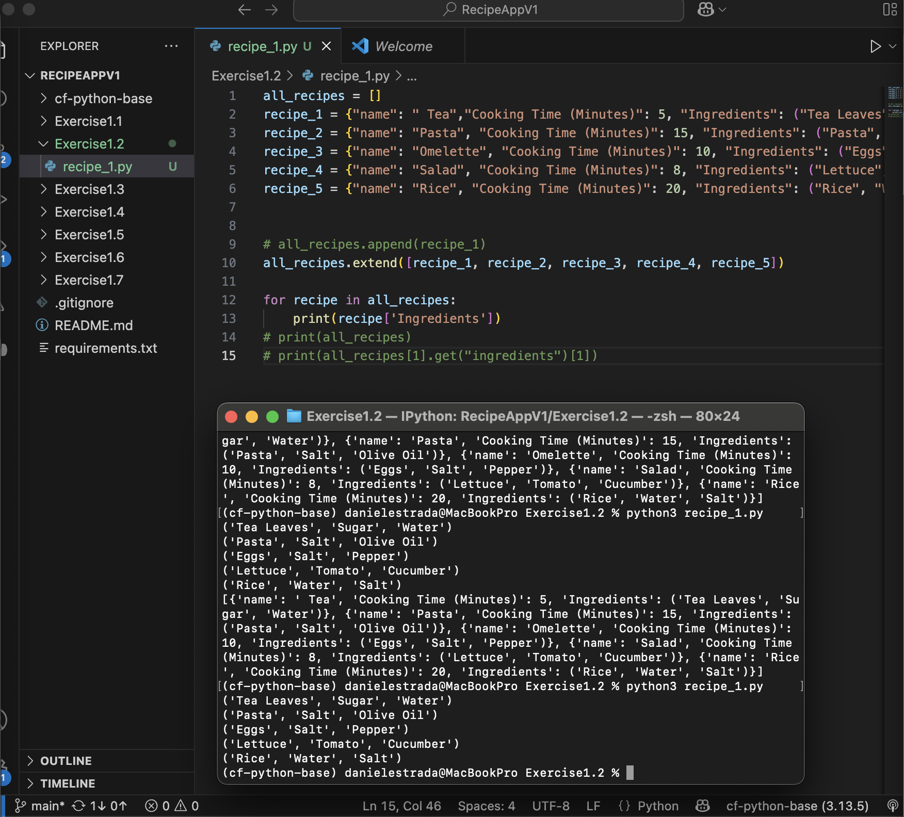

# Recipe App – Section 1.2

This is the first step of the **Recipe App** project for the Python for Web Developers course.  
In this section, I practiced using **lists** and **dictionaries** in Python to represent recipes.

---

## Project Goal
The goal is to build a basic structure for storing and accessing recipes, which will later evolve into a more complete command-line application.

---

## Why Lists and Dictionaries?
I decided to use a **list of dictionaries** because:

- **Dictionaries** store values and objects indexed by identifiers (keys), making it easy to access recipe attributes like name, cooking time, or ingredients.
- **Lists** are mutable objects, so I can add, remove, or update recipes without recreating the entire data structure.

This combination allows me to manage multiple recipes efficiently and access them by position when needed.

---

## Code Example
Here is the implementation for Section 1.2:

```python
all_recipes = []

recipe_1 = {"name": "Tea", "Cooking Time (Minutes)": 5, "Ingredients": ("Tea Leaves", "Sugar", "Water")}
recipe_2 = {"name": "Pasta", "Cooking Time (Minutes)": 15, "Ingredients": ("Pasta", "Salt", "Olive Oil")}
recipe_3 = {"name": "Omelette", "Cooking Time (Minutes)": 10, "Ingredients": ("Eggs", "Salt", "Pepper")}
recipe_4 = {"name": "Salad", "Cooking Time (Minutes)": 8, "Ingredients": ("Lettuce", "Tomato", "Cucumber")}
recipe_5 = {"name": "Rice", "Cooking Time (Minutes)": 20, "Ingredients": ("Rice", "Water", "Salt")}

all_recipes.extend([recipe_1, recipe_2, recipe_3, recipe_4, recipe_5])

for recipe in all_recipes:
    print(recipe['Ingredients'])
```

---

## Demo: running the code (image)

Below is a screenshot showing the terminal after running `recipe_1.py`. The output lists the ingredients for each recipe.



To reproduce this output locally, run:

```bash
python Exercise1.2/recipe_1.py
```

You should see the ingredients tuple printed for each recipe in `all_recipes`.
