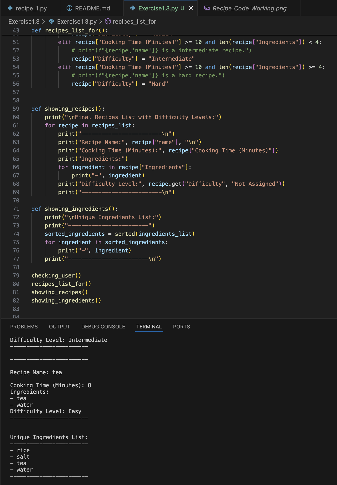

# Exercise 1.3 - Practice and Tasks

## Overview

In this exercise, I practiced working with **lists**, **dictionaries**,
and **loops** in Python.\
The main goal was to build a function that classifies recipes by
difficulty based on cooking time and the number of ingredients.

------------------------------------------------------------------------

## Tasks Completed

### 1. Working with Lists

-   Created a list of test scores and sorted them in descending order
    using:

    ``` python
    test_scores.sort(reverse=True)
    ```

-   Printed only the **top three scores** from the sorted list.

-   Practiced removing duplicates from a list using:

    -   `set()`
    -   `dict.fromkeys()`
    -   Loops with condition checks

-   Checked the **length of a list** using `len(my_list)`.

### 2. Working with Dictionaries

-   Learned how to add new key-value pairs to a dictionary using:

    ``` python
    dictionary[key] = value
    ```

-   Updated the recipe dictionaries by adding a `"Difficulty"` key.

### 3. Recipe Difficulty Function

-   Created a function called `recipes_list_for()` that:
    -   Iterates through all recipes in `recipes_list`.
    -   Classifies each recipe into:
        -   **Easy** → cooking time \< 10 min and \< 4 ingredients\
        -   **Medium** → cooking time \< 10 min and ≥ 4 ingredients\
        -   **Intermediate** → cooking time ≥ 10 min and \< 4
            ingredients\
        -   **Hard** → cooking time ≥ 10 min and ≥ 4 ingredients\
    -   Adds the `"Difficulty"` classification back into each recipe
        dictionary.

Example:

``` python
if recipe["Cooking Time (Minutes)"] < 10 and len(recipe["Ingredients"]) < 4:
    recipe["Difficulty"] = "Easy"
```

### 4. Printing and Formatting

-   Practiced printing with `\n` to **add blank lines**.
-   Printed ingredients with clean formatting, one per line.

## Demo: running the code (image)

Below is a screenshot showing the terminal after running `recipe_1.py`. The output lists the ingredients for each recipe.



------------------------------------------------------------------------

## Example Output

    {'name': 'Pasta', 'Cooking Time (Minutes)': 12, 'Ingredients': ['pasta', 'sauce', 'cheese'], 'Difficulty': 'Intermediate'}
    Pasta is an intermediate recipe.

------------------------------------------------------------------------

## Folder Organization

Inside the **Exercise 1.3** folder: - A subfolder **1.3-Practice Task
2** was created for screenshots of the steps and outputs.

------------------------------------------------------------------------

## Learnings

-   How to manipulate lists (sorting, removing duplicates, checking
    length).\
-   How to update and extend dictionaries.\
-   How to loop through lists of dictionaries and modify them.\
-   How to format printed output for better readability.
