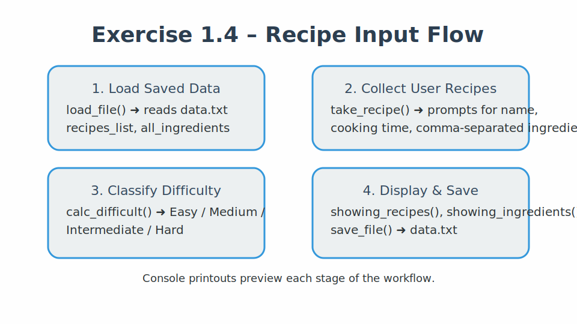
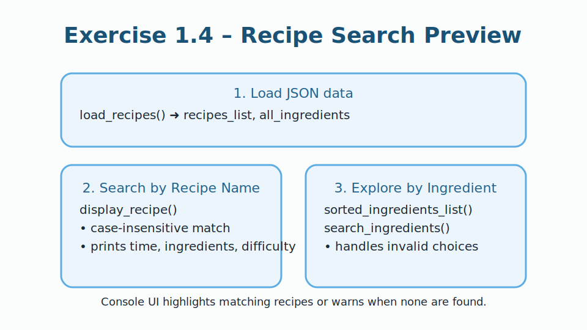

# Exercise 1.4 - Recipe App Enhancements

## Overview

In this exercise, I upgraded the recipe application so it can **load**
existing data, **collect new recipes interactively**, and **search** the
dataset using JSON as the storage format.\
The workflow now spans two scripts: `recipe_input.py` for capturing and
saving recipes and `recipe_search.py` for looking them up by name or by
ingredient.

------------------------------------------------------------------------

## Tasks Completed

### 1. Loading and Persisting Data with JSON

-   Read the previously saved recipe collection from `data.txt` using
    the `json` module.
-   Stored the in-memory `recipes_list` and `all_ingredients` back to
    disk with `json.dump()` so new entries persist between runs.

### 2. Collecting Recipes from the Command Line

-   Prompted the user for the recipe name, cooking time, and a
    comma-separated list of ingredients.
-   Normalized the ingredients by trimming whitespace and stored every
    recipe in the shared `recipes_list` object.
-   Maintained a **de-duplicated ingredient catalogue** by appending only
    unseen ingredients to `ingredients_list`.

### 3. Difficulty Classification Logic

-   Reused the difficulty matrix from the previous exercise to assign
    one of four labels based on cooking time and ingredient count:

    ``` python
    if recipe["Cooking Time (Minutes)"] < 10 and len(recipe["Ingredients"]) < 4:
        recipe["Difficulty"] = "Easy"
    ```

-   Printed a preview of the enriched recipe objects after classification
    to verify the updates.

### 4. Console Presentation

-   Displayed each recipe with clear separators, the cooking time, a
    bullet list of ingredients, and the computed difficulty level.
-   Sorted the unique ingredient list alphabetically before printing it
    back to the user for quick scanning.

### 5. Recipe Search Experience

-   Built `recipe_search.py` to load the same JSON file and reuse the
    stored data structures.
-   Implemented `display_recipe()` for **case-insensitive** lookups by
    recipe name, including a friendly message when nothing matches.
-   Listed all available ingredients with numeric indices so the user can
    select an ingredient and see every recipe that uses it.
-   Added error handling for invalid numbers, missing ingredients, and
    unexpected issues to keep the app responsive.

------------------------------------------------------------------------

## Visual Walkthrough

-   Recipe entry flow with loading, classification, and saving stages:

    

-   Search utility highlighting name and ingredient discovery paths:

    

------------------------------------------------------------------------

## Example Console Flow

    Welcome to the Recipe App!
    Enter the path to the data file: Exercise1.4/data.txt
    🔎 Current object preview: {...}
    Do you want to add a recipe? (yes/no): yes
    Entering details for recipe 1:
    Enter the recipe name: Pasta
    ...
    Data saved to data.txt

------------------------------------------------------------------------

## Folder Organization

Inside the **Exercise 1.4** folder:

-   `recipe_input.py` handles loading, input prompts, difficulty
    tagging, printing, and persistence.
-   `recipe_search.py` provides the lookup experience for existing data.
-   `data.txt` stores the JSON payload created by the input script.
-   `Images/` contains SVG diagrams that illustrate both workflows.

------------------------------------------------------------------------

## Learnings

-   How to serialize nested dictionaries and lists with JSON.
-   How to keep ingredient lists unique while still appending new data.
-   How to share a persisted dataset between two separate Python
    programs.
-   How to harden interactive scripts with validation and friendly
    console output.
