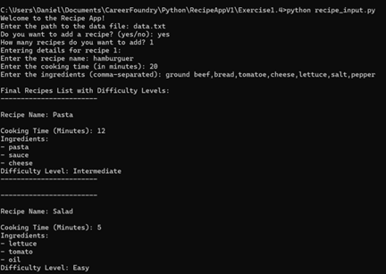
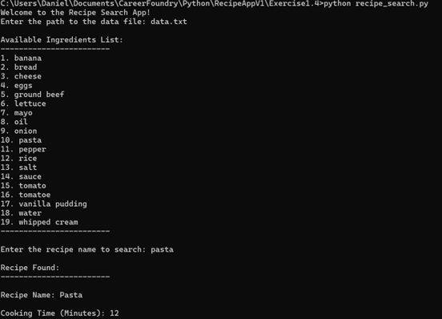
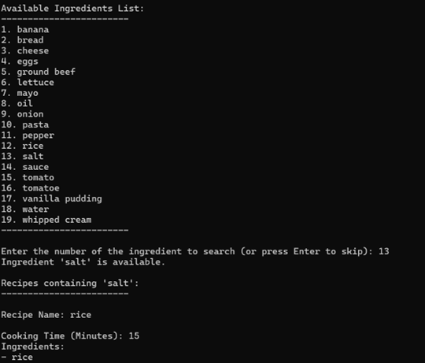

# Exercise 1.4 - Recipe App Enhancements

## Overview

In this exercise, I upgraded the command-line Recipe App to work with
**persistent JSON data**, **interactive user input**, and **searchable
recipe listings**. The goal was to connect two scripts—one for adding
recipes and another for searching them—while keeping the difficulty
classification logic from previous exercises.

------------------------------------------------------------------------

## Tasks Completed

### 1. Loading Saved Data

-   Prompted the user for the path to an existing `data.txt` file.
-   Loaded the JSON structure with recipes and ingredients using `json.load()`.
-   Displayed quick previews of the data to confirm everything loaded correctly.

### 2. Capturing New Recipes

-   Asked whether the user wanted to add one or more recipes.
-   Gathered recipe details: name, cooking time, and comma-separated ingredients.
-   Kept the global `recipes_list` and `ingredients_list` updated so duplicates are avoided.

Example snippet:

``` python
recipe = {
    "name": recipe_name,
    "Cooking Time (Minutes)": int(cooking_time),
    "Ingredients": [ingredient.strip() for ingredient in ingredients]
}
```

### 3. Difficulty Classification & Reporting

-   Reused the difficulty tiers (Easy, Medium, Intermediate, Hard) based on cooking time and ingredient count.
-   Printed a formatted summary for every recipe, including its difficulty label.
-   Generated a sorted list of unique ingredients for quick reference.

### 4. Saving Updates to Disk

-   Wrote the updated `main_data` object back to `data.txt` with `json.dump()`.
-   Confirmed the save action to the user before exiting the input script.

### 5. Searching Through Recipes

-   Built a companion script that reads the same JSON data set.
-   Listed all available ingredients with index numbers for quick selection.
-   Allowed recipe lookups by **name** and by **ingredient membership**.
-   Added friendly error handling for missing files, invalid numbers, and unmatched results.

------------------------------------------------------------------------

## Demo: running the scripts (images)

Below are recreated terminal-style snapshots that highlight the updated workflow.






## Demo: running the code (image)

------------------------------------------------------------------------

## Example Outputs

From `recipe_input.py`:

```
Final Recipes List with Difficulty Levels:
------------------------
Recipe Name: Pasta 
Cooking Time (Minutes): 12
Ingredients:
- pasta
- sauce
- cheese
Difficulty Level: Intermediate
```

From `recipe_search.py`:

```
Available Ingredients List:
------------------------
1. banana
2. bread
3. cheese
...
Ingredient 'salt' is available.
Recipes containing 'salt':
------------------------
Recipe Name: rice 
Cooking Time (Minutes): 15
Ingredients:
- rice
- salt
Difficulty Level: Intermediate
```

------------------------------------------------------------------------

## Folder Organization

Inside the **Exercise 1.4** folder:

-   `recipe_input.py` handles loading data, capturing recipes, and saving updates.
-   `recipe_search.py` focuses on displaying the catalog and running searches.
-   `data.txt` stores the JSON payload shared by both scripts.
-   `Screenshots/` contains recreated SVG snapshots of the app in action.

------------------------------------------------------------------------

## Learnings

-   How to persist Python dictionaries to disk and reload them with JSON.
-   How to chain multiple scripts together through a shared data file.
-   How to validate interactive input and report errors gracefully.
-   How to format console output so recipes and ingredients remain readable.