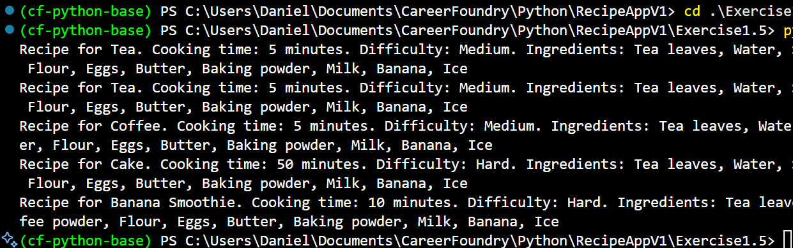

# Exercise 1.5 - Recipe App Object-Oriented Design

## Overview

In this exercise, I refactored the Recipe App into an **object-oriented**
architecture that centralizes recipe logic inside a dedicated `Recipe`
class. The update focused on encapsulating behaviors such as difficulty
classification, ingredient aggregation, and search utilities, enabling a
cleaner and more reusable codebase compared to the earlier procedural
approach.

------------------------------------------------------------------------

## Tasks Completed

### 1. Designing the `Recipe` Class

-   Introduced a `Recipe` blueprint with attributes for the recipe name
    and cooking time.
-   Added a shared `all_ingredients` class attribute that keeps the
    catalog of every unique ingredient across instances.
-   Implemented a robust `__str__` method to produce human-friendly
    summaries for any recipe object.

### 2. Managing Ingredients Collectively

-   Created the `add_ingredient()` class method to append one or more
    ingredients while avoiding duplicates in the shared list.
-   Added the `get_ingredients()` accessor for quickly viewing the full
    ingredient registry.
-   Built `update_all_ingredients()` to ingest bulk ingredient updates
    from external collections without duplicating entries.

### 3. Difficulty Classification & Reporting

-   Embedded the existing tier logic inside `calculate_difficulty()` so
    each recipe object can self-classify based on cooking time and the
    overall ingredient breadth.
-   Ensured that the difficulty label appears automatically in the
    stringified representation of every recipe instance.

### 4. Searching Through Recipes

-   Provided `search_ingredient()` to verify if a target ingredient is
    present in the global list.
-   Implemented `recipe_search()` to scan a list of recipe objects and
    print each match that contains the specified ingredient.
-   Demonstrated the search helper by retrieving every recipe that uses
    "Sugar" from a sample dataset.

### 5. Demonstrating the Workflow

-   Instantiated four recipe objects (`Tea`, `Coffee`, `Cake`, and
    `Banana Smoothie`) with their respective cooking times.
-   Populated the shared ingredient list by calling `add_ingredient()` on
    each instance.
-   Printed a formatted overview of the tea recipe, showcasing the
    calculated difficulty tier and the consolidated ingredient list.

------------------------------------------------------------------------

## Demo: running the scripts (images)



------------------------------------------------------------------------

## Example Outputs

From `recipe_oop.py`:

```
Recipe for Tea. Cooking time: 5 minutes. Difficulty: Medium. Ingredients: Tea leaves, Water, Sugar, Coffee powder, Flour, Eggs, Butter, Baking powder, Milk, Banana, Ice
Recipe for Tea. Cooking time: 5 minutes. Difficulty: Medium. Ingredients: Tea leaves, Water, Sugar, Coffee powder, Flour, Eggs, Butter, Baking powder, Milk, Banana, Ice
Recipe for Coffee. Cooking time: 5 minutes. Difficulty: Medium. Ingredients: Tea leaves, Water, Sugar, Coffee powder, Flour, Eggs, Butter, Baking powder, Milk, Banana, Ice
Recipe for Cake. Cooking time: 50 minutes. Difficulty: Hard. Ingredients: Tea leaves, Water, Sugar, Coffee powder, Flour, Eggs, Butter, Baking powder, Milk, Banana, Ice
Recipe for Banana Smoothie. Cooking time: 10 minutes. Difficulty: Hard. Ingredients: Tea leaves, Water, Sugar, Coffee powder, Flour, Eggs, Butter, Baking powder, Milk, Banana, Ice
```

------------------------------------------------------------------------

## Folder Organization

Inside the **Exercise 1.5** folder:

-   `recipe_oop.py` defines the `Recipe` class, populates sample
    instances, and demonstrates the search functionality.
-   `consoleTest1.5.png` captures the terminal session that prints the
    formatted recipe summaries and search results.
-   `Learning-Journal.pdf` records reflections and study notes from this
    milestone.

------------------------------------------------------------------------

## Learnings

-   How to encapsulate recipe data and behavior inside a reusable Python
    class.
-   How to use class attributes to maintain state shared across multiple
    instances.
-   How to implement helper methods that allow recipes to search for
    ingredients and render formatted summaries autonomously.
-   How to translate a procedural script into an object-oriented module
    without losing existing business logic.
